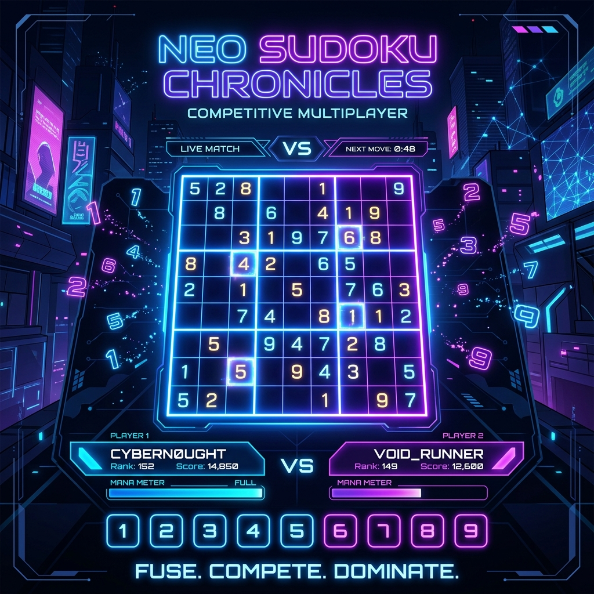

# 🧩 Sudoku Showdown (Sudoku Online)

[](https://react.dev)
[](https://vite.dev)
[](https://tailwindcss.com)
[](https://github.com/websockets/ws)
[](https://webrtc.org)
[](https://supabase.com)
[](https://github.com/pmndrs/zustand)



Sudoku Showdown is a state-of-the-art, feature-rich, **real-time multiplayer Sudoku platform**. It goes far beyond classic Sudoku by infusing **real-time competitive matchmaking**, **P2P WebRTC voice chat**, **live gameplay spectating**, and **mana-based sabotage abilities**. Play solo to sharpen your skills, or queue up to face opponents worldwide and climb the ELO ranks.

---

## 🎮 How to Start Playing

### 1. Match Selection
On the home dashboard, choose your playstyle:
*   **Solo Practice**: Play offline or at your own pace. Select a difficulty setting (Beginner, Medium, Hard, Expert).
*   **Competitive Matchmaking**: Search for an opponent online. The server matches you with players near your ELO tier.
*   **Custom Room**: Create a private lobby, toggling the competitive features on or off, and share the 6-digit lobby code with friends.
*   **Spectator Mode**: Enter an active room's code as a spectator to watch players battle in real-time.

---

### 2. Basic Gameplay Controls
*   **Cell Selection**: Click or tap any empty cell on the grid to highlight it.
*   **Inserting Numbers**: Press any number on the keypad (`1`-`9`) or use your keyboard keys.
*   **Notes Mode (Pencil Marks)**: Click the **Notes** button (or press `N` on the keyboard) to toggle pencil marks. This allows you to write candidate numbers in cells. 
    > [!TIP]
    > **Smart Notes Auto-Removal**: Entering a correct number in a cell automatically clears that number from the notes in its corresponding row, column, and 3x3 block.
*   **Erase**: Click the **Erase** button (or press `Backspace`/`Delete`) to clear any incorrect numbers or notes.
*   **Undo/Redo**: Tap **Undo** or **Redo** to step through your board configurations.
*   **Mistakes & Strikes**: In competitive matches, making an incorrect guess incurs a **Strike**. If you accumulate **3 Strikes**, you are immediately eliminated (`Game Over`). In Solo Mode, you can customize your tolerance, while Practice Mode allows unlimited tries.

---

### 3. Mana & Sabotages Guide
During multiplayer matches, speed and accuracy earn you **Mana**, which you can spend on three different sabotages to disrupt your opponent's board:

*   🔥 **Generating Mana**: Each correct number placement awards mana.
*   ⚡ **Combo Streaks**: Placing consecutive correct numbers without making mistakes builds your Combo Streak, multiplying the mana gained per move.

#### Sabotage Shop Inventory:
| Sabotage | Mana Cost | Effect | How to Clear |
| :--- | :---: | :--- | :--- |
| 🔮 **Ink Splash (`ink`)** | `40` | Splashes 3 glowing pink glassmorphic blots randomly over your opponent's board, hiding their numbers and grid lines. | Desktop: Hover/drag cursor over splashes.<br>Mobile: Swipe over ink spots to wipe them clean. |
| ⚡ **Keypad Scramble (`scramble`)** | `50` | Randomly shuffles the layout of the opponent's input keypad for 7 seconds. Keys flash with a `GLITCH` alert. | Wait out the 7-second cooldown. Keypad shuffles back to normal automatically. |
| 🛡️ **Cleanse Shield (`cleanse`)** | `30` | Instantly removes any active ink splashes or scrambled keypad effects on your board and gains an immunity shield. | Grants active protection blocking any incoming sabotage attacks for 5 seconds. |

---

### 4. Live P2P Voice Chat
*   When entering a custom room or matched game, click **Join Voice** to initiate voice communication.
*   Your browser will ask for microphone permissions to establish a secure, Peer-to-Peer audio link using WebRTC.
*   Toggle mute/unmute easily from the top status menu.

---

### 5. Live Spectator Mode
*   Enter a match as a spectator to watch a split-screen live stream of both players' grids side-by-side.
*   Track each player's ELO, active cell highlights, mistakes, and note grids in real-time.
*   *Spectator Alert*: Competitors receive a neat toast notification when someone joins or leaves their audience.

---

## 🏆 ELO & Rank Tiers

Players earn or lose ELO points based on match outcomes. Your ELO brackets determine your rank tier:

| ELO Bracket | Rank Tier | Color Theme | Custom Badge |
| :---: | :---: | :---: | :---: |
| `2000+` | **Grandmaster** | 👑 Purple & Gold | `[ GM ]` |
| `1800 - 1999` | **Master I** | 🌟 Deep Purple | `[ M1 ]` |
| `1600 - 1799` | **Platinum II** | 💠 Platinum Blue | `[ P2 ]` |
| `1400 - 1599` | **Diamond IV** | 💎 Neon Teal | `[ D4 ]` |
| `1200 - 1399` | **Gold III** | 🟡 Gold Amber | `[ G3 ]` |
| `1000 - 1199` | **Silver II** | ⚪ Silver Grey | `[ S2 ]` |
| `100 - 999` | **Bronze I** | 🟤 Bronze | `[ B1 ]` |

> [!IMPORTANT]
> The default starting ELO rating is **1450 (Diamond IV)**. 
> Profiles, ELO updates, and avatars sync with **Supabase Database** when signed in. Guest play uses an offline local simulator.

---

## 📐 System Architecture

The following diagram illustrates the interaction between the client, WebSocket server, third-party systems, and the WebRTC Peer-to-Peer voice channel:

```mermaid
sequenceDiagram
    participant User A (Client)
    participant WS Server
    participant User B (Client)
    participant Supabase
    participant Metered API

    Note over User A, WS Server: Matchmaking & Game Sync
    User A->>WS Server: REGISTER_PLAYER (ELO, Supabase ID)
    User A->>WS Server: Enter Matchmaking Queue
    WS Server->>WS Server: Match ELO & Difficulty
    WS Server-->>User A: MATCH_FOUND (Room Code)
    WS Server-->>User B: MATCH_FOUND (Room Code)

    Note over User A, User B: WebRTC Voice Chat Negotiation
    WS Server->>Metered API: Fetch ICE Servers
    Metered API-->>WS Server: Return TURN/STUN credentials
    WS Server-->>User A: ICE_SERVERS_RESPONSE
    WS Server-->>User B: ICE_SERVERS_RESPONSE
    User A->>WS Server: Send WebRTC Offer (SIGNAL_DATA)
    WS Server->>User B: Forward Offer
    User B->>WS Server: Send WebRTC Answer (SIGNAL_DATA)
    WS Server->>User A: Forward Answer
    User A<->>User B: Establish Direct P2P Audio Connection

    Note over User A, User B: In-game Sabotages (WebSocket)
    User A->>WS Server: USE_ABILITY (scramble)
    WS Server->>User B: ABILITY_APPLIED (scramble)
    Note over User B: Keypad is scrambled for 7s

    Note over User A, Supabase: Persistence
    User A->>Supabase: Save custom avatars/Profile sync
```

### ⚡ Connection Safeguard & Reconnection
*   **15-Second Grace Window**: If a player's browser window disconnects or reloads mid-game, the WebSocket server holds their slot for 15 seconds.
*   **Dynamic Reconnection**: Upon restarting, the client reads the cached active room code and auto-negotiates a reconnection. The opponent is notified, and the board state is synced back instantly.

---

## 🛠️ Getting Started & Local Setup

### 📋 Prerequisites
Ensure you have the following installed on your machine:
*   **Node.js**: `v18.x` or higher
*   **npm**: `v9.x` or higher

### ⚙️ Environment Configuration

#### 1. Client Environment (`client/.env`)
Create a `.env` file in the `client/` folder:
```env
# URL of your backend WebSocket server
VITE_WS_URL=ws://localhost:3001

# Supabase Configurations (Optional)
# If omitted, the game automatically operates in guest mode (offline local DB simulator)
VITE_SUPABASE_URL=https://your-project-id.supabase.co
VITE_SUPABASE_ANON_KEY=your-anon-public-api-key
```

#### 2. Server Environment (`server/.env`)
Create a `.env` file in the `server/` folder:
```env
# Port the Express/WS server will listen on
PORT=3001

# Metered.ca TURN/STUN API Credentials (Optional, required for P2P voice call NAT traversal)
METERED_APP_NAME=your-metered-app-name
METERED_DOMAIN=your-metered-domain.metered.live
METERED_API_KEY=your-metered-api-key
```

---

### 🚀 Running the Project Locally

1.  **Clone the Repository**:
    ```bash
    git clone https://github.com/TanvirHasanHridoy/Sudoku-Online.git
    cd Sudoku-Online
    ```

2.  **Install All Dependencies**:
    This uses npm workspaces to pull down dependencies for both the `client` and `server` monorepo workspaces in one command:
    ```bash
    npm run install:all
    ```

3.  **Run Development Servers**:
    You will need to run both the frontend client and the backend server:
    *   **Start the WebSocket & Express Server**:
        ```bash
        npm run server:dev
        ```
        *Runs on port `3001`*
    *   **Start the React/Vite Client**:
        ```bash
        npm run client:dev
        ```
        *Runs on [http://localhost:5173](http://localhost:5173)*

4.  **Production Build**:
    To bundle the frontend for production deployment:
    ```bash
    npm run build
    ```

---

## 📂 Monorepo Structure

```
sudoku-multiplayer-root/
├── package.json               # Root monorepo configuration (npm workspaces)
├── client/                    # React frontend application
│   ├── src/
│   │   ├── components/        # UI components (Keypad, SudokuGrid, SabotageOverlay)
│   │   ├── lib/               # Third-party integrations (supabase.js)
│   │   ├── store/             # Zustand state management
│   │   │   ├── useAuthStore.js
│   │   │   ├── useGameStore.js
│   │   │   ├── useLobbyStore.js
│   │   │   └── useSocialStore.js
│   │   ├── utils/             # Sudoku generators, solvers, and persistence
│   │   ├── App.jsx            # Main app controller & routing views
│   │   └── main.jsx           # Entry point
│   ├── public/                # Static assets, icons, and avatars
│   └── package.json
└── server/                    # Node.js Express & WebSocket server
    ├── src/
    │   └── server.js          # Unified lobby matchmaking & signaling server
    └── package.json
```

---

## 📝 License
Distributed under the MIT License. See [LICENSE](LICENSE) for more information.
